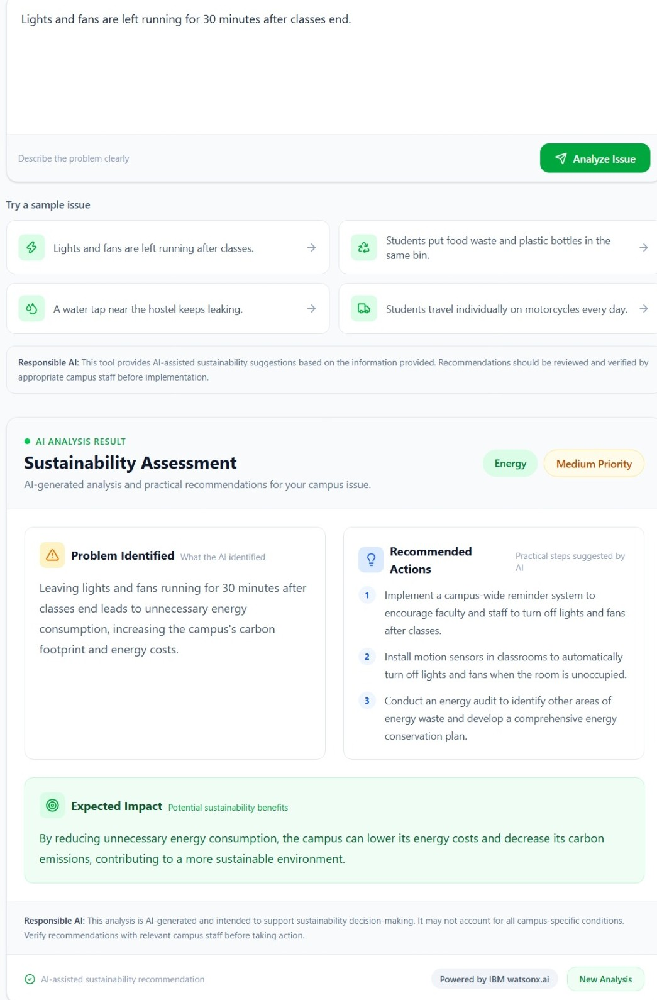
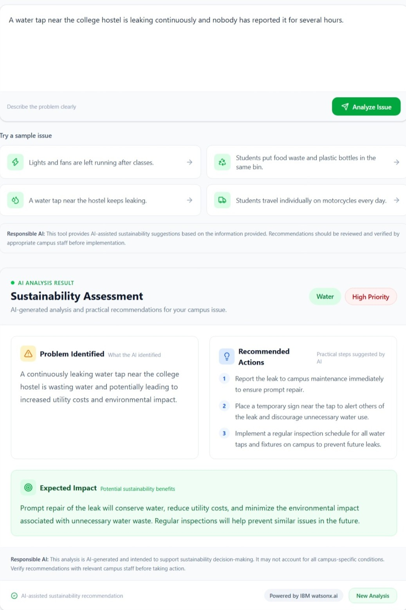
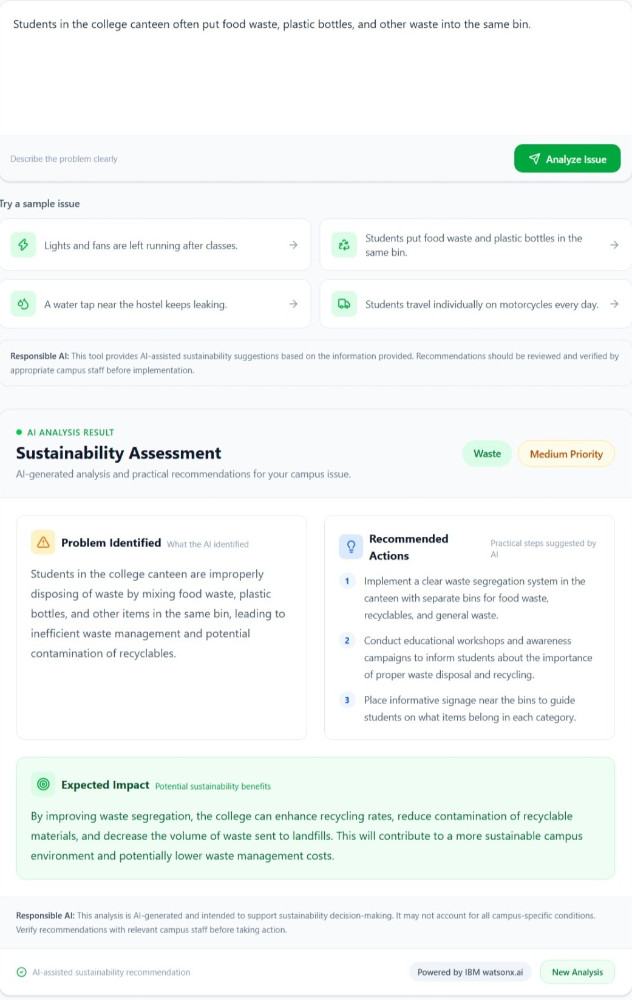
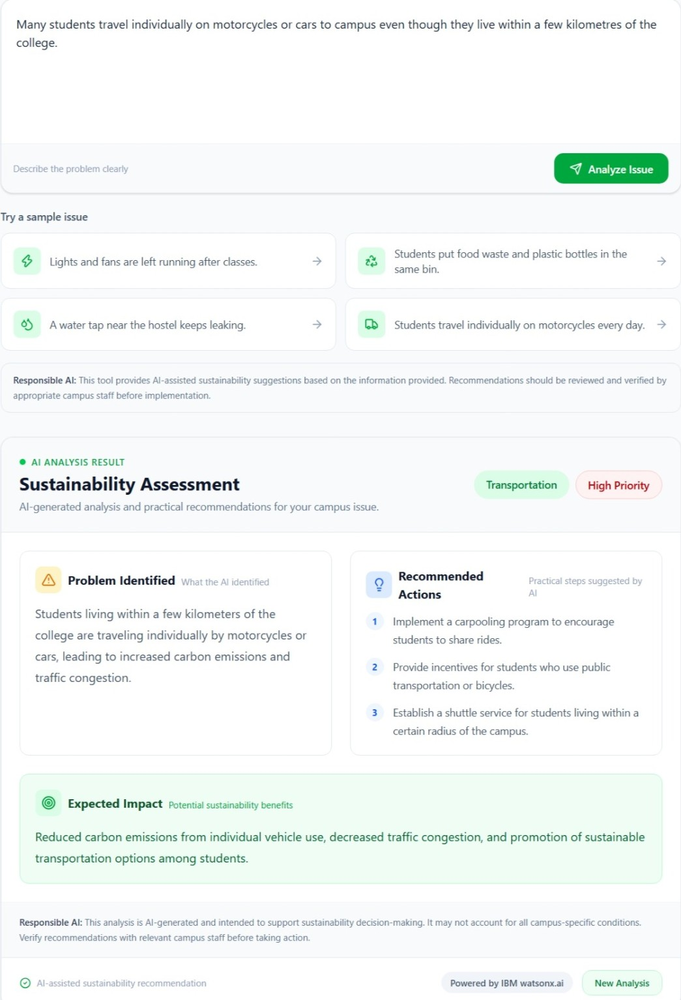
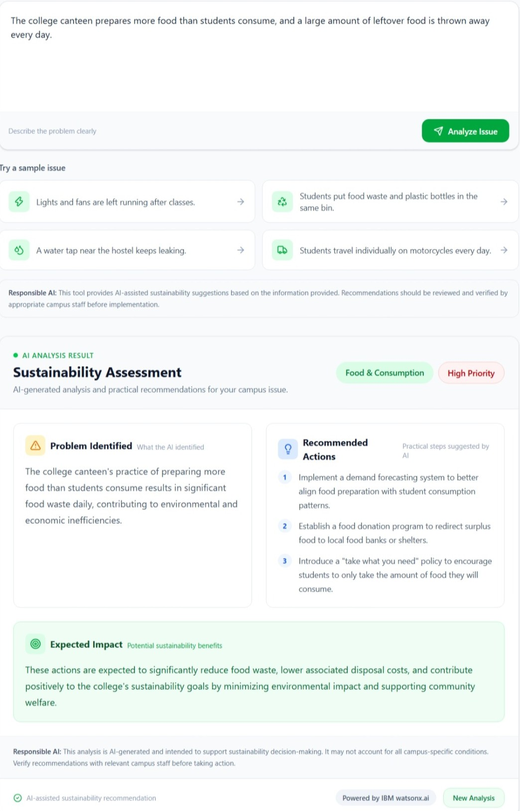

# 🌱 CampusAI — AI Sustainability Advisor

CampusAI is an AI-powered sustainability advisor designed specifically for college campuses. It helps students and institutions analyze common campus sustainability problems and receive practical, actionable recommendations.

The system allows a user to describe a sustainability issue in natural language. The issue is sent to a Node.js backend, which communicates with IBM watsonx.ai to generate an AI-assisted sustainability assessment.

The generated response includes the sustainability category, priority level, identified problem, recommended actions, and expected impact.

---

## 📌 Problem Statement

College campuses face several sustainability challenges such as unnecessary energy consumption, water wastage, improper waste disposal, food wastage, and excessive use of private transportation.

These problems are often identified informally, and students may not know what practical actions can be taken to address them.

CampusAI aims to provide a simple AI-assisted solution where users can describe a campus sustainability issue and receive practical recommendations for addressing it.

---

## 🌍 SDG Alignment

CampusAI supports the United Nations Sustainable Development Goals (SDGs), particularly:

### SDG 4 — Quality Education
The project promotes awareness and learning about sustainable practices among students and campus communities.

### SDG 6 — Clean Water and Sanitation
The system can identify water-related problems such as leaking taps and unnecessary water wastage and suggest corrective actions.

### SDG 7 — Affordable and Clean Energy
The system can analyze problems involving unnecessary electricity consumption, such as lights and fans being left on in empty classrooms.

### SDG 11 — Sustainable Cities and Communities
The project encourages sustainable practices within educational communities and promotes responsible resource management.

### SDG 12 — Responsible Consumption and Production
CampusAI addresses waste management, food wastage, plastic consumption, and responsible use of campus resources.

### SDG 13 — Climate Action
By encouraging energy conservation, waste reduction, sustainable transportation, and responsible consumption, the project contributes to climate-conscious practices.

---

## 🎯 Objective

The main objectives of CampusAI are:

- To provide an easy-to-use AI-based sustainability analysis tool for college campuses.
- To allow users to describe sustainability problems using natural language.
- To classify campus problems into relevant sustainability categories.
- To provide an AI-generated priority level.
- To identify the main sustainability problem.
- To suggest practical actions that can be taken.
- To communicate the potential sustainability impact of those actions.
- To promote sustainability awareness among students and campus communities.
- To demonstrate the practical use of generative AI for sustainability-related challenges.

---

## ✨ Features

### 1. AI Sustainability Analyzer
Users can enter a real or hypothetical sustainability problem occurring on a college campus.

### 2. Natural Language Input
Users can describe problems in their own words instead of selecting from predefined categories.

### 3. AI-Based Classification
The system uses IBM watsonx.ai to analyze the submitted problem and determine an appropriate sustainability category.

### 4. Priority Assessment
The AI provides a priority level to help communicate the relative importance of the issue.

### 5. Problem Identification
The system explains the sustainability problem identified from the user's description.

### 6. Recommended Actions
The AI provides practical actions that can help address the identified issue.

### 7. Expected Impact
The system explains the potential sustainability benefits of implementing the recommended actions.

### 8. Multiple Sustainability Areas
The prototype can analyze problems related to areas such as:

- Energy
- Water
- Waste
- Transportation
- Food and consumption

### 9. Responsible AI Guidance
The application clearly communicates that AI-generated recommendations should be reviewed and verified by appropriate campus staff before implementation.

### 10. Error Handling
The application provides an error message when the AI service or backend cannot process a request instead of allowing the interface to fail silently.

### 11. Invalid Input Handling
The application prevents obviously invalid or extremely short inputs from being unnecessarily sent to the AI service.

### 12. New Analysis
Users can clear the current result and analyze another campus sustainability issue.

---

## 🛠️ Technology Stack

### Frontend

- React.js
- JavaScript
- Tailwind CSS
- Vite
- Lucide React

### Backend

- Node.js
- Express.js

### AI

- IBM watsonx.ai
- Generative AI model available through the IBM watsonx.ai service

### Development Tools

- Visual Studio Code
- npm
- Git
- GitHub

---

## 🤖 AI Technology

CampusAI uses **IBM watsonx.ai** as the generative AI service.

The user's sustainability problem is sent from the React frontend to the Node.js/Express backend.

The backend securely communicates with IBM watsonx.ai using the configured API credentials.

The AI analyzes the problem and generates a structured sustainability assessment containing:

```text
Category
Priority
Problem Identified
Recommended Actions
Expected Impact

## 🧪 Testing

 ### Test Case 1
 

 ### Test Case 2
 

 ### Test Case 3
 

 ### Test Case 4
 

 ### Test Case 5
 
